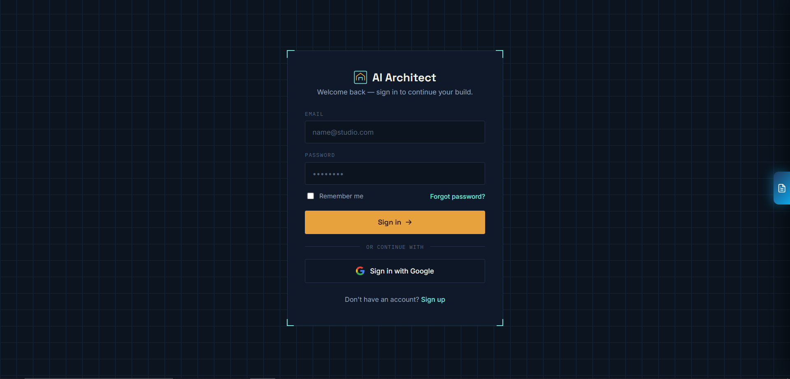
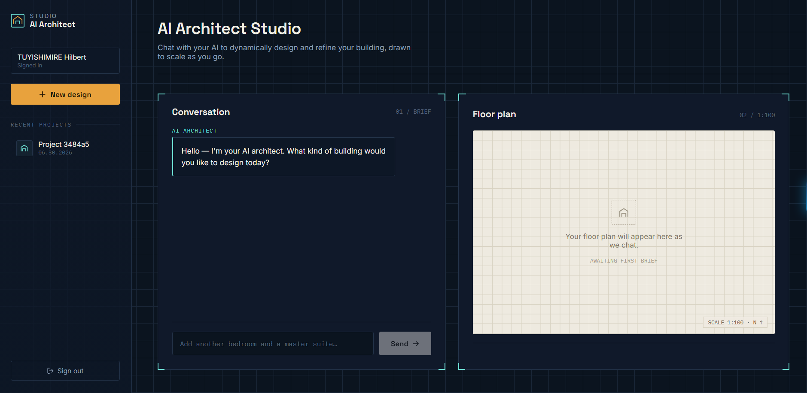

# AI Architect Studio

Welcome to **AI Architect Studio**, a next-generation generative AI platform designed to dynamically build, assess, and refine architectural floor plans through natural language conversations.



## 🚀 The Vision

Traditional architectural software requires steep learning curves and manual drafting. AI Architect Studio flips the paradigm: you simply chat with your AI Architect, describe what you want, and the system **mathematically generates** a compliant, to-scale floor plan in real-time. 

As you continue chatting—asking to add a bedroom, expand a kitchen, or reshape the plot—the platform remembers your previous context and dynamically re-renders the layout.



## ✨ Core Capabilities

### 1. Conversational AI Design (Stateful NLP)
- **Natural Language Input**: "I want a modern 3-bedroom house with a master suite and outside boy's quarters." 
- **Context-Aware Memory**: The system remembers your ongoing conversation. If you say "Add one more bathroom," the AI precisely updates the project parameters without losing previous instructions.
- **Powered by Google Gemini**: Advanced LLM extraction maps your casual requests into structured architectural graphs and room counts.

### 2. Custom Physics-Based Layout Engine
Instead of snapping together pre-made templates, our custom **force-directed physics engine** creates layouts from scratch. 
- Rooms attract logically connected adjacent rooms (e.g., Kitchen to Dining Room).
- Rooms repel each other to prevent overlapping.
- The engine runs hundreds of iterations in milliseconds to find the mathematically optimal room arrangement that fits within your plot boundaries.

### 3. Automated Compliance & Auto-Routing Validator
The generated graph isn't just pretty—it's heavily validated against **Kigali/Gasabo zoning laws and sanitation regulations**:
- **Privacy Enforcement**: A bathroom cannot open directly into a living room or kitchen. If the AI detects this, the internal auto-router automatically injects buffer corridors to resolve the violation.
- **Plot Constraints**: Checks against maximum allowed area and setback rules.

### 4. Smart Wall, Door & Window Generation
Once the rooms are placed, the engine physically models the walls:
- **Exposed Wall Detection**: Determines which sides of a room face the outside.
- **Dynamic Door/Window Placement**: Automatically calculating mathematical centers for exterior windows and entrances, while smartly carving out internal passage doors where adjacent rooms touch.

### 5. High-Quality CAD Export
- Instant browser viewing via **Interactive SVG**.
- Direct export to **DXF** format for seamless integration into AutoCAD, ArchiCAD, and other professional drafting software.

### 6. Public Conversation Sharing
- Need feedback from a client or colleague? Click **Share** to generate a public link to your design session.
- Guests load straight into a "View-Only" mode where they can see the floor plan and the chat history, but cannot modify your design.

##  Tech Stack

- **Backend:** Python 3.12, FastAPI, SQLAlchemy, Google GenAI SDK, SQLite/PostgreSQL
- **Frontend:** React (Vite), Tailwind CSS, Framer Motion
- **Layout Rendering:** Custom Python Graph Physics, SVG & DXF Generation Engine
- **Deployment:** Vercel (Frontend & Serverless Functions), Supabase (Postgres)

##  Setup Instructions

### 1. Backend Setup

1. Open a terminal and navigate to the `backend/` directory.
2. Ensure you have Python 3.12+ installed.
3. Activate the virtual environment:
   ```bash
   .\venv\Scripts\activate
   ```
4. Install dependencies:
   ```bash
   pip install -r requirements.txt
   ```
5. Set your Gemini API Key as an environment variable:
   ```bash
   $env:GEMINI_API_KEY="your_api_key_here"
   ```
6. Start the FastAPI server:
   ```bash
   python -m uvicorn app.main:app --host 0.0.0.0 --port 8000
   ```
   *The API will be available at http://localhost:8000*

### 2. Frontend Setup

1. Open a new terminal and navigate to the `frontend/` directory.
2. Install dependencies:
   ```bash
   npm install
   ```
3. Start the Vite development server:
   ```bash
   npm run dev
   ```
4. Open the URL provided in the terminal (usually http://localhost:5173) in your browser.

##  Deployment (Vercel)

This project is configured to be deployed as a full-stack serverless application on Vercel, using a Postgres database (like Supabase) for chat history persistence.

### 1. Database Setup (Supabase)
1. Create a free project on [Supabase](https://supabase.com/).
2. Navigate to your Project Settings -> Database.
3. Copy the **Connection String (URI)** for SQLAlchemy / PostgreSQL.

### 2. Vercel Deployment
1. Install the Vercel CLI: `npm i -g vercel`
2. From the root directory, run:
   ```bash
   vercel --prod
   ```
3. In your Vercel Dashboard, go to your project's **Settings > Environment Variables** and add:
   - `GEMINI_API_KEY`: Your Google Gemini API Key
   - `DATABASE_URL`: Your Supabase Connection String.

*Note: If `DATABASE_URL` is omitted (e.g. for local development), the app will fallback to a local SQLite database file.*
